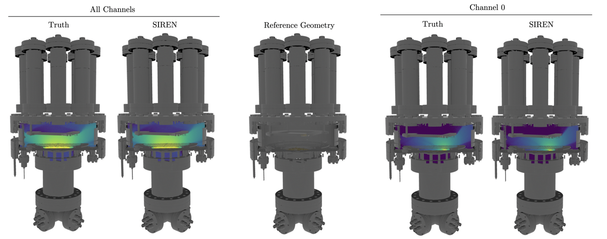
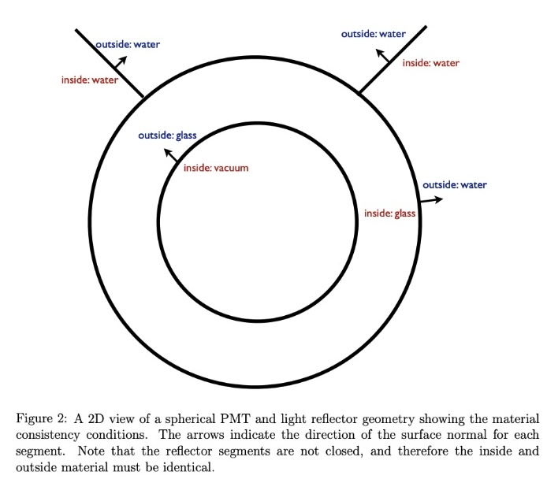
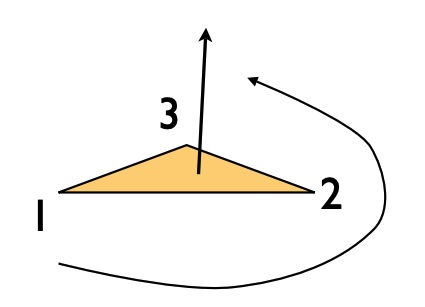
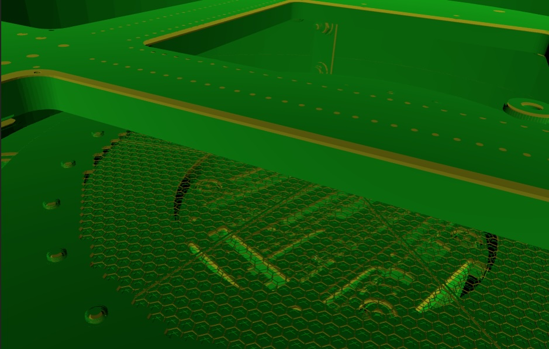
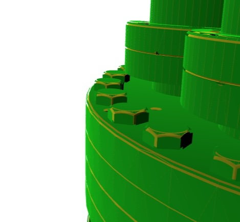

# Chroma-LAr

<p align="center">

</p>

Chroma-LAr provides a set of tools for modeling and analyzing the behavior of photons in liquid argon detectors using [chroma-lite](https://github.com/youngsm/chroma-lite) simulation framework. It includes:

- Scaffolding for defining custom geometries and materials for liquid argon detectors
- Tools to create, save, and use light maps in detectors
- Utilities for visualizing detector geometry and photon trajectories
- Integration with [SIREN](https://www.vincentsitzmann.com/siren/)-based neural networks to learn detector lightmaps

`chroma` allows for the simulation of complex geometries with arbitrary detector configurations, materials, and surfaces using the [chroma](https://github.com/benland100/chroma) simulation framework, a CUDA-based fast optical propagator with relevant physics processes. From the original repo,

>Chroma is a high performance optical photon simulation for particle physics detectors originally written by A. LaTorre and S. Seibert. It tracks individual photons passing through a triangle-mesh detector geometry, simulating standard physics processes like diffuse and specular reflections, refraction, Rayleigh scattering and absorption.
>
>With the assistance of a CUDA-enabled GPU, Chroma can propagate 2.5 million photons per second in a detector with 29,000 photomultiplier tubes. This is 200x faster than the same simulation with GEANT4.

`chroma` requires a CUDA-enabled GPU to work. To check if your GPU is CUDA-enabled, you can use the [CUDA GPU Checker](https://developer.nvidia.com/cuda-gpus). We will use [`chroma-lite`](https://github.com/youngsm/chroma-lite), which is a lighter version of `chroma` for just optical propagation -- with no Geant4 integration for particle propagation and scintillation generation.

### Installing chroma-lite

`chroma-lite` can be installed via pip, i.e.,

```bash
pip install -e git+https://github.com/youngsm/chroma-lite
```

</details>

### Setting up `chroma-lar` for use.

Install chroma-lar by following the instructions below.

```bash
# Clone the repository
git clone https://github.com/youngsm/chroma-lar.git
# Set up the environment
source chroma-lar/env.sh
# Add the environment setup to your bashrc (optional)
echo "source $PWD/chroma-lar/env.sh" >> ~/.bashrc
```

Note that `env.sh` adds the `chroma-lar` directory to your `PYTHONPATH`. This allows you to import the modules from the repository in your scripts.

## Geometries

Chroma uses a geometry defined using double-sided triangles. A triangle's physical properties is fully defined by it's _inside_ material, _outside_ material, and a surface material. 

### Material considerations

The **inside (`material1`) and outside (`material2`) materials** identify the bulk properties of the two media the boundary separates.
* E.g., index of refraction and absorption lengths. See [`geometry/materials.py`](geometry/materials.py).

The **surface material** describes the optical properties of the surface
* E.g., diffuse and specular reflectivity, detection efficiency. See [`geometry/surfaces.py`](geometry/surfaces.py).

<p align="center">

</p>

Above is an example of the sort of materials you'd want to use for a spherical pmt + reflector submerged in water (a la SNO), taken from the Chroma whitepaper.

The orientation of a triangle is found by using the right hand rule on the triangle vertices in the order in which they are defined. This normal is defined as the direction of the inside material. 

<p align="center">

</p>

This is extremely important when defining the geometry of your detector, as the orientation of the triangles will determine the direction of the inside material. If you switch your inside and outside materials, Chroma might think that your detector volume is solid stainless steel and not liquid argon.

To check which material Chroma thinks is the inside and outside material, you can use the [`materials_checker.ipynb`](notebooks/materials_checker.ipynb) notebook or [`materials_checker.py`](macros/materials_checker.py) macro. This notebook will show you a visualization of the inside and outside materials based on the orientation of the triangles in a STL file by plotting two copies of the detector, one unchanged in yellow (the inner material) and one "exploded" view in green (the outer material). In most cases, the STL is correctly defined such that the inside material (yellow) is the the solid material (like SS) and the outside material (green) is the detector medium (like LAr). See example from the notebook below:

<p align="center">


</p>

From this STL we see that the inside material (yellow) is stainless steel and the outside material (green) would be liquid argon.


## Running Simulations and Analyses

> These notes are adapted from notes provided by Ben Land.

This repository uses a python-based simulation and analysis framework, [`pyrat`](pyrat), first developed by Ben Land at UPenn. The `pyrat` file is ran in conjunction with a _macro_, which is a python script that defines methods that pyrat will run at different stages of the simulation. Example usage:

```bash
pyrat macros/sample_sim.py --output test_output.root --evalset num_photons 1000
```

This command will run the `sample_sim.py` macro, outputting the results to `test_output.root`, and setting `db.num_photons`, the number of photons in each photon bomb, to 1000 instead of the default value used in `__configure__`.

### Macros

The macro is responsible for setting up the simulation, running the simulation, and analyzing the output. An example macro is found in `macros/sample_sim.py`.

* `__configure__(db)` is called once when the macro is loaded to add or modify fields in the database. This happens after any `--db` packages specified at runtime are loaded, but before any `--set` or `--evalset` options are evaluated. Returns nothing. Optional.

* `__define_geometry__(db)` is called once after `__configure__` and should return a Chroma geometry (pyrat will flatten and build the BVH) if a simulation is to be performed. If the result is None or this method does not exist, pyrat will not run a Chroma simulation, and will assume you are running an analysis over existing data. Optional.

* `__event_generator__(db)` should be a [python generator](https://wiki.python.org/moin/Generators) that yields something Chroma can simulate (`chroma.event.Event`, `chroma.event.Vertex`, or `chroma.event.Photons`) if running a simulation, or anything you want passed to `__process_event__` during an analysis.

* `__simulation_start__(db)` and `__simulation_end__(db)` are called before and after the event loop, which iterates over the event generator and calls `__process_event__` for each event.

* `__process_event__(db,ev)` receives the events from the event generator as they are generated. If a simulation is being performed, these will be Chroma `chroma.event.Event` objects post-simulation.

### Input/output

Macros are allowed to define any form of input/output they desire. It is suggested to use simple datastructures to store analysis results. Chroma defines a ROOT datastructure that stores all relevant Chroma event properties, and should be used for that purpose. Reading is done similarly. To save each event using this datastructure, add the `--output` flag to the pyrat command line arugments.

```bash
pyrat /path/to/macro.py --output /path/to/output.root
```

Similarly, if you already have a ROOT file with Chroma events that you want to re-analyze, you can use the `--input` flag.

```bash
pyrat /path/to/macro.py --input /path/to/input.root
```

### Databases (`db`)

The `database` module contains code to allow a python package (or module) to 
define a database that maps string keys to arbitrary values like a python 
dictionary. 

Each module in the package can define a property `__exports__` which should be
a list of variable names in the module to add to the database. 

Any module can define an `__opt_exports__` function which will be passed a 
dictionary of run-dependent options and can return a dictionary of keys and 
values to add to a database.

A database can be used like a standard python dictionary: `value = db[key]`.
It can also access string keys that are valid python variable names as fields
of the database object: `value = db.key`.

The `data` package contains default pyrat paramters and is self-documenting. 
For instance, see `data.chroma` for parameters that control the `Chroma` 
simulation. Macros can `__configure__` the database to add or modify fields, 
and load additional properties. The pyrat executable defines `--set` and 
`--evalset` options which set strings or python values (i.e., evaluated) to database keys. These are done in the order they are described, so runtime sets take precedence.
